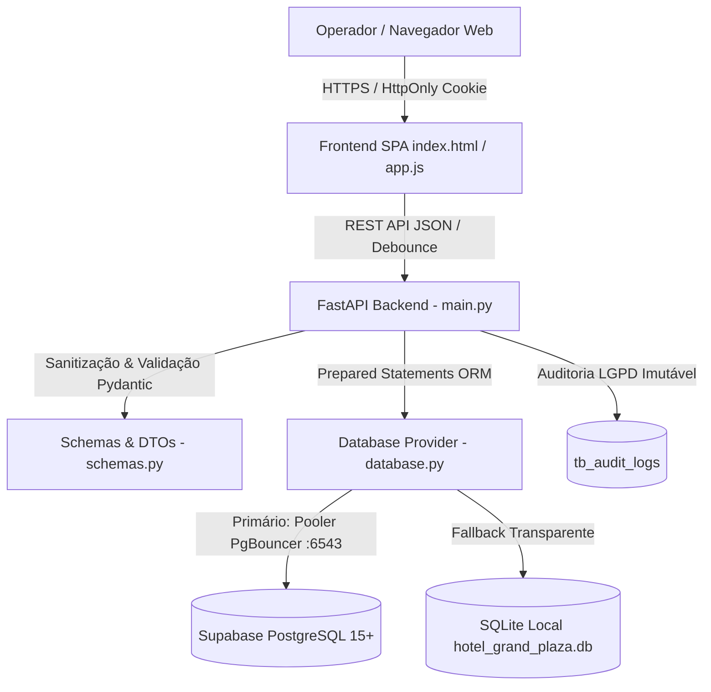

# DOCUMENTO DE ESPECIFICAÇÃO DE REQUISITOS E ARQUITETURA SEGURA (SSD)
## Laboratório de Inovação III — Prof. Edilberto Silva — 2026

---

## 1. METADADOS DO PROJETO E DA EQUIPE

### 1.1 Composição da Equipe (GRUPO-06 — SEMANA-02)

| ID | Nome Completo | Papel Primário | Papel Secundário | E-mail Institucional / Contato |
| :---: | :--- | :--- | :--- | :--- |
| 1 | **João Miguel Paiva Velloso Ramos Pereira** | Scrum Master | Desenvolvedor Back-End | `jguel0713@gmail.com` |
| 2 | **João Victor Sousa da Conceição** | Desenvolvedor Front-End | QA / SecDevOps | `joao47064706@edu.df.senac.br` |

**Lista de Integrantes para o Moodle:**  
`jguel0713@gmail.com; joao47064706@edu.df.senac.br`

### 1.2 Identificação do Projeto

- **NOME_DO_PROJETO:** Grand Plaza Hotel Management System
- **DESCRICAO_BREVE:** Sistema web corporativo em arquitetura SPA para gestão hoteleira, autenticação segura com HttpOnly cookies, busca preditiva instantânea, edição cadastral com imutabilidade de CPF, desativação lógica (Soft Delete) com conformidade LGPD e persistência resiliente dual (Supabase PostgreSQL / SQLite local).

### 1.3 Localização dos Artefatos

- **PACOTE_DE_ENTREGA:** `GRUPO-06-SEMANA-02.zip`
- **LINK_REPOSITORIO_GITHUB:** https://github.com/Dimmy-dev/grand-hotel
- **BRANCH_PRINCIPAL:** `main`
- **LINK_APLICACAO_DEPLOY:** https://grand-hotel-tawny.vercel.app
- **LINK_BANCO_DADOS:** Supabase PostgreSQL 15+ (Datacenter São Paulo `sa-east-1` via PgBouncer na porta 6543) + SQLite local de resiliência empacotado (`hotel_grand_plaza.db`)
- **LINK_API_SWAGGER:** https://grand-hotel-tawny.vercel.app/docs
- **ARQUIVO_SWAGGER_LOCAL:** `docs/api/swagger.json`

---

## 2. ESTRUTURA DE DIRETÓRIOS DO PROJETO

```text
Trabalho_Edilberto/
├── docs/
│   ├── requisitos/
│   │   ├── RF-001-cadastro-hospede.md
│   │   └── RF-002-alterar-hospede.md         <-- ESTE DOCUMENTO OFICIAL DE ENTREGA
│   └── api/
│       └── swagger.json                       <-- Contrato OpenAPI 3.1 com endpoints do RF-002
│
├── src/
│   ├── rf-001-cadastro-hospede/              <-- Módulo entregue na Semana 01
│   └── rf-002-alterar-hospede/               <-- CÓDIGO-FONTE DESTE REQUISITO
│       ├── index.html                        <-- SPA com Busca Preditiva, Badges e Modal de Edição
│       ├── app.js                            <-- Cliente JavaScript Modular (Debounce e REST)
│       ├── main.py                           <-- Backend FastAPI com rotas GET, PUT e PATCH
│       ├── schemas.py                        <-- Schemas Pydantic (HospedeUpdateSchema e Status)
│       ├── models.py                         <-- Modelos ORM SQLAlchemy com mapeamento relacional
│       ├── database.py                       <-- Provedor resiliente (Supabase / SQLite local)
│       ├── hotel_grand_plaza.db              <-- Banco SQLite local com carga inicial
│       ├── requirements.txt                  <-- Dependências Python
│       └── README.md                         <-- Manual de execução local
│
├── database/
│   ├── ddl/
│   │   ├── rf-001-hospedes-ddl.sql
│   │   └── rf-002-hospedes-alter-ddl.sql     <-- Índices de performance para busca e status
│   └── seeds/
│       └── hospedes-seeds.sql                <-- Carga de operadores e hóspedes de homologação
│
├── regras/
│   ├── front.md                              <-- Diretrizes de UI e Design Tokens
│   ├── back.md                               <-- Arquitetura Backend e Endpoints
│   ├── DB.md                                 <-- Especificação do Banco Relacional
│   └── documentação.md                       <-- Manual de Governança e Rubrica
│
├── requirements.txt                          <-- Dependências raiz
├── README.md                                 <-- Guia geral do repositório
└── .gitignore                                <-- Exclusão de arquivos sensíveis
```

---

# DETALHAMENTO DO REQUISITO FUNCIONAL: RF-002

---

## 🎯 1. IDENTIFICAÇÃO DO REQUISITO (2%)

- **ID:** RF-002
- **Título:** Consulta Rápida, Edição Cadastral e Desativação Segura de Hóspedes (LGPD)
- **Tipo:** Requisito Funcional
- **Prioridade:** ALTA (Necessário para a manutenção de contatos dos clientes, prevenção de inconsistências e atendimento à conformidade com a LGPD)
- **Complexidade:** MÉDIA (Estimado em 3 Story Points — envolve busca em tempo real com debounce, modal acessível, imutabilidade de chave fiscal e trilha de auditoria para Soft Delete)
- **Status:** CONCLUÍDO
- **Data de Criação:** 10/09/2026
- **Última Atualização:** 16/09/2026

**Breve Descrição:**  
O sistema deve permitir que operadores autenticados pesquisem hóspedes instantaneamente através de múltiplos campos (nome, CPF ou e-mail), filtrem registros pelo status de atividade, visualizem os detalhes cadastrais, editem dados de contato (nome, e-mail, telefone e observações) mantendo o CPF rigorosamente inalterável e realizem a desativação ou reativação lógica (*Soft Delete*), gravando cada ação na trilha imutável de auditoria.

---

## 📋 2. DESCRIÇÃO E ATORES (10%)

### 2.1 Por que este requisito existe? (Objetivos de Negócio)
1. **Agilidade no Balcão de Atendimento:** Permite que a recepção localize o cadastro de um hóspede recorrente em frações de segundo através de busca preditiva parcial.
2. **Atualização Cadastral Confiável:** Garante a correção de telefones e e-mails para envio de confirmações de reserva e faturas, prevenindo falhas de comunicação.
3. **Integridade Fiscal Inegociável:** Ao travar o CPF contra edições no formulário, elimina o risco de adulteração de histórico fiscal ou troca fraudulenta de titularidade.
4. **Conformidade com a LGPD e Embratur:** Viabiliza o atendimento ao "direito ao esquecimento" regulatório através de inativação lógica sem violar o dever legal de manter o histórico de estadas (Portaria MTur/Embratur).

### 2.2 Atores e Permissões (Matriz CRUD)

| Ator | Create (Criar) | Read (Consultar / Buscar) | Update (Editar) | Delete (Desativar / Reativar) |
| :--- | :---: | :---: | :---: | :---: |
| **Recepcionista** | Sim (RF-001) | Sim (Busca completa) | Sim (Contatos e observações) | Não (Apenas consulta e edição) |
| **Gerente Geral** | Sim (RF-001) | Sim (Busca completa) | Sim (Edição total autorizada) | Sim (Pode inativar e reativar) |
| **Administrador** | Sim (RF-001) | Sim (Acesso irrestrito) | Sim (Edição total irrestrita) | Sim (Acesso total) |
| **Usuário Anônimo**| Não | Não | Não | Não |

---

## ⚙️ 3. CASOS DE USO E REQUISITOS NÃO-FUNCIONAIS (20%)

### 3.1 Especificação do Caso de Uso: UC-002 — Gestão e Edição de Hóspede
- **Ator Primário:** Operador Autenticado (Recepcionista / Gerente).
- **Pré-condições:** O operador deve estar autenticado com sessão válida (HttpOnly Cookie ativo).
- **Pós-condições:** Os dados do hóspede são persistidos no banco de dados e uma linha de auditoria com snapshot das alterações é gerada em `tb_audit_logs`.

#### Fluxo Principal (Cenário Feliz):
1. O operador acessa a visão operacional da recepção.
2. O sistema exibe a listagem dos hóspedes com busca preditiva e botões de filtro.
3. O operador digita o nome, CPF ou e-mail no campo de pesquisa.
4. O sistema aguarda 300ms de inatividade do teclado (Debounce) e requisita `GET /api/v1/hospedes?q={termo}`.
5. O sistema atualiza a tabela imediatamente com os registros encontrados.
6. O operador clica no botão "Editar" de um hóspede específico.
7. O sistema abre o modal de edição acessível, preenchendo Nome, E-mail, Telefone, Observações e exibindo o CPF em modo travado (somente leitura).
8. O operador modifica o telefone de contato e clica em "Salvar Alterações".
9. O frontend valida os campos e envia a requisição `PUT /api/v1/hospedes/{uuid}`.
10. O backend valida a requisição, atualiza os campos em transação atômica, gera o log em `tb_audit_logs` e retorna HTTP 200 OK.
11. O modal é fechado automaticamente e a tabela reflete o novo dado.

#### Fluxos Alternativos e de Exceção:
* **FA-01: E-mail Duplicado na Edição:** Se o novo e-mail informado já pertencer a outro hóspede, o backend rejeita a transação com HTTP 409 Conflict (`DUPLICATE_EMAIL`). O modal exibe mensagem inline abaixo do campo sem fechar a janela.
* **FA-02: Inativação Lógica (*Soft Delete*):** O operador clica em "Inativar". O sistema solicita confirmação explícita. Ao confirmar, envia `PATCH /api/v1/hospedes/{uuid}/status` com `{"is_ativo": 0}`. O backend altera a flag e grava log `DESATIVACAO_HOSPEDE`. O badge visual na tabela muda para "Inativo" em cinza.

### 3.2 Regras de Negócio Estritas (RNs)
- **RN-01 (Imutabilidade do CPF):** O CPF do hóspede não pode ser alterado por rotas de edição convencionais. Permanece idêntico ao cadastrado originalmente.
- **RN-02 (Proibição de Hard Delete):** Em nenhuma circunstância o registro físico deve ser excluído com comando `DELETE` SQL. Toda exclusão é estritamente lógica (`is_ativo = 0`).
- **RN-03 (Unicidade de E-mail Inter-registros):** Ao editar o e-mail, o sistema deve garantir que nenhum outro hóspede já possua aquele e-mail cadastrado.
- **RN-04 (Auditoria Obrigatória):** Toda alteração cadastral ou de status deve gravar o IP, data/hora UTC e o diff dos dados em `tb_audit_logs`.

### 3.3 Requisitos Não-Funcionais (RNFs)
- **RNF-01 (Desempenho de Busca):** A busca preditiva deve responder em menos de 100ms através dos índices B-Tree `idx_hospedes_ativo` e `idx_hospedes_nome`.
- **RNF-02 (Economia de Tráfego / Debounce):** O input de busca deve implementar debounce de 300ms para evitar requisições redundantes a cada caractere digitado.
- **RNF-03 (Conformidade com a LGPD):** Minimização e rastreabilidade total de dados sensíveis na trilha de auditoria.
- **RNF-04 (Resiliência Dual):** O sistema deve operar tanto conectado ao Supabase PostgreSQL na nuvem quanto com o banco SQLite local em caso de avaliação offline.

---

## 🖥️ 4. PROTÓTIPO FUNCIONAL E EXPERIÊNCIA DO USUÁRIO (40%)

### 4.1 Características da Interface SPA
* **Paleta Corporativa Antisslop:** Uso estrito de Slate (`#0f172a`, `#64748b`) com acento Navy Real (`#1e3a8a`), sem emojis informais em botões ou cabeçalhos.
* **Barra de Pesquisa Preditiva:** Input estilizado com ícone SVG monocromático de lupa e tags de filtro rápido (*Todos*, *Ativos*, *Inativos*).
* **Tabela de 6 Colunas:** `Nome do Hóspede`, `E-mail`, `CPF`, `Telefone`, `Status` e `Ações`.
* **Badges de Status Semânticos:** Verde sutil com indicador circular para hóspedes *Ativos* e cinza ardósia para hóspedes *Inativos*.
* **Modal Acessível com Backdrop Blur:** Janela de diálogo com efeito de vidro fosco, bloqueio de interação no fundo (*focus trap*) e botão de fechar acessível via teclado.

---

## 🏛️ 5. ARQUITETURA DE SOFTWARE E DECISÕES TÉCNICAS (15%)

### 5.1 Diagrama de Contêineres (Mermaid)



### 5.2 Registros de Decisão Arquitetural (ADRs)

* **ADR-01: Adoção de Soft Delete via Flag Booleana (`is_ativo`):**
  * *Contexto:* Hóspedes podem solicitar cancelamento de cadastro ou ter pendências resolvidas.
  * *Decisão:* Adotar exclusivamente `is_ativo = 0` acompanhado de log em `tb_audit_logs`.
  * *Consequência:* Protege a integridade relacional com futuras reservas e atende aos prazos de guarda legal exigidos pelo Ministério do Turismo.
* **ADR-02: Debounce Client-Side no Campo de Pesquisa:**
  * *Contexto:* Usuários digitam rapidamente termos de busca com 5 a 20 caracteres.
  * *Decisão:* Implementar temporizador de 300ms no evento `input` do JavaScript.
  * *Consequência:* Redução de até 80% no volume de requisições HTTP enviadas à infraestrutura serverless da Vercel e ao Supabase.
* **ADR-03: Imutabilidade Estrita do Campo CPF na Edição:**
  * *Contexto:* Possibilidade de erro de digitação original no CPF.
  * *Decisão:* Travar o campo `cpf` no DTO de atualização e desabilitá-lo visualmente no modal.
  * *Consequência:* Previne fraudes de identidade e sequestro de cadastro. Correções de CPF exigem criação de nova ficha auditada.

---

## 🛡️ 6. MATRIZ DE SEGURANÇA E CONFORMIDADE OWASP (10%)

| Risco OWASP | Ameaça Potencial | Medida de Mitigação Implementada | Validação |
| :--- | :--- | :--- | :--- |
| **A01: Broken Access Control** | Usuário deslogado tentar chamar `PUT` ou `PATCH` direto pela URL | Middleware e dependência `obter_operador_autenticado` validando cookie criptografado | Responde 401 Unauthorized para acessos sem sessão ativa |
| **A03: Injection** | Injeção SQL no campo de busca (`q=' OR '1'='1`) | Uso exclusivo de consultas parametrizadas via SQLAlchemy ORM (`.ilike()`) | O termo malicioso é tratado puramente como string literal |
| **A03: Stored XSS** | Injeção de tags `<script>` no campo de observações ao editar | Sanitização compulsória via `html.escape()` em `HospedeUpdateSchema` | Tags HTML são neutralizadas antes de persistir no banco |
| **A07: Identification Failures** | Roubo de token de sessão via scripts maliciosos de terceiros | Sessão baseada em cookie com atributos `HttpOnly`, `SameSite=Lax` e `Secure` | Impossibilidade de leitura do token via JavaScript |
| **LGPD / Privacidade** | Vazamento de dados em logs do servidor | Mascaramento de dados e gravação de snapshots estruturados em `tb_audit_logs` | Auditoria completa com IP e operador responsável |

---

## 📖 7. DOCUMENTAÇÃO DA API E CONTRATO SWAGGER (3%)

Os novos endpoints foram rigorosamente incorporados ao contrato oficial:
- **Arquivo Local Exportado:** `docs/api/swagger.json`
- **Swagger UI Interativo Online:** https://grand-hotel-tawny.vercel.app/docs

### 7.1 Especificação das Novas Rotas REST

#### 1. Busca e Listagem Preditiva
* **Método/Rota:** `GET /api/v1/hospedes`
* **Query Parameters:** `q` (string opcional para busca) e `status_filtro` (`todos`, `ativos`, `inativos`).
* **Respostas:** `200 OK` com array de hóspedes.

#### 2. Detalhes do Hóspede
* **Método/Rota:** `GET /api/v1/hospedes/{uuid}`
* **Respostas:** `200 OK` com dados detalhados ou `404 Not Found`.

#### 3. Atualização Cadastral
* **Método/Rota:** `PUT /api/v1/hospedes/{uuid}`
* **Payload:** `{"nome": "...", "email": "...", "telefone": "...", "observacoes": "..."}`
* **Respostas:** `200 OK` (sucesso), `409 Conflict` (e-mail duplicado) ou `422 Unprocessable Entity`.

#### 4. Alternância de Status (Soft Delete)
* **Método/Rota:** `PATCH /api/v1/hospedes/{uuid}/status`
* **Payload:** `{"is_ativo": 0}` ou `{"is_ativo": 1}`
* **Respostas:** `200 OK` com mensagem de confirmação ou `404 Not Found`.
