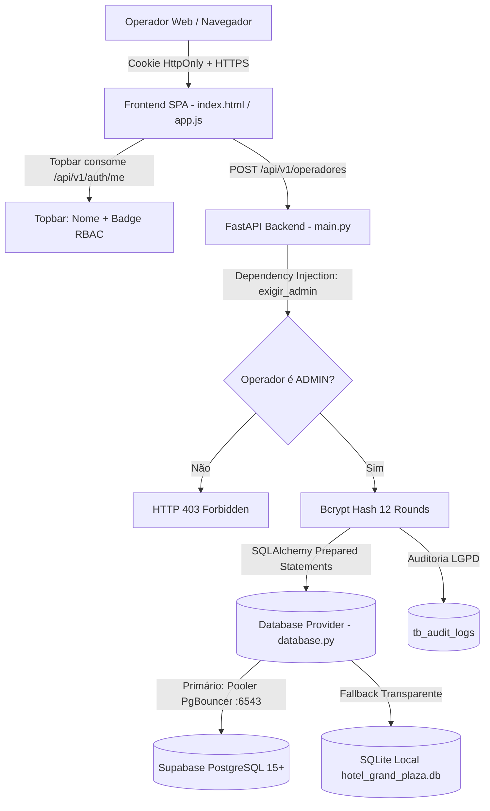

# DOCUMENTO DE ESPECIFICAÇÃO DE REQUISITOS E ARQUITETURA SEGURA (SSD)
## Laboratório de Inovação III — Prof. Edilberto Silva — 2026

---

## 1. METADADOS DO PROJETO E DA EQUIPE

### 1.1 Composição da Equipe (GRUPO-06 — SEMANA-04)

| ID | Nome Completo | Papel Primário | Papel Secundário | E-mail Institucional / Contato |
| :---: | :--- | :--- | :--- | :--- |
| 1 | **João Miguel Paiva Velloso Ramos Pereira** | Scrum Master | Desenvolvedor Back-End | `jguel0713@gmail.com` |
| 2 | **João Victor Sousa da Conceição** | Desenvolvedor Front-End | QA / SecDevOps | `joao47064706@edu.df.senac.br` |

**Lista de Integrantes para o Moodle:**  
`jguel0713@gmail.com; joao47064706@edu.df.senac.br`

### 1.2 Identificação do Projeto

- **NOME_DO_PROJETO:** Grand Plaza Hotel Management System
- **DESCRICAO_BREVE:** Sistema web corporativo em arquitetura SPA para gestão hoteleira com controle de acesso baseado em papéis (RBAC), autenticação com HttpOnly cookies, topbar com perfil e nível de acesso ativo, gestão e cadastro seguro de operadores com hash Bcrypt, desativação lógica (Soft Delete) e persistência resiliente dual (Supabase PostgreSQL / SQLite local).

### 1.3 Localização dos Artefatos

- **PACOTE_DE_ENTREGA:** `GRUPO-06-SEMANA-04.zip`
- **LINK_REPOSITORIO_GITHUB:** https://github.com/Dimmy-dev/grand-hotel
- **BRANCH_PRINCIPAL:** `main`
- **LINK_APLICACAO_DEPLOY:** https://grand-hotel-tawny.vercel.app
- **LINK_BANCO_DADOS:** Supabase PostgreSQL 15+ (Datacenter São Paulo `sa-east-1` via PgBouncer na porta 6543) + SQLite local de resiliência empacotado (`hotel_grand_plaza.db`)
- **LINK_API_SWAGGER:** https://grand-hotel-tawny.vercel.app/docs
- **ARQUIVO_SWAGGER_LOCAL:** `docs/api/swagger.json`

---

## 2. ESTRUTURA DE DIRETÓRIOS DO PROJETO

```text
Trabalho_Edilberto/
├── docs/
│   ├── requisitos/
│   │   ├── RF-001-cadastro-hospede.md        <-- Semana 01 e 02
│   │   ├── RF-002-alterar-hospede.md         <-- Semana 03
│   │   └── RF-003-cadastro-usuario.md         <-- ESTE DOCUMENTO OFICIAL (Semana 04)
│   └── api/
│       └── swagger.json                       <-- Contrato OpenAPI 3.1 com endpoints do RF-003
│
├── src/
│   ├── rf-001-cadastro-hospede/
│   ├── rf-002-alterar-hospede/
│   └── rf-003-cadastro-usuario/              <-- CÓDIGO-FONTE DESTE REQUISITO
│       ├── index.html                        <-- SPA com Topbar Informativa e RBAC
│       ├── app.js                            <-- Cliente JavaScript (5 Estados visuais e REST)
│       ├── main.py                           <-- Backend FastAPI com RBAC e endpoints de operadores
│       ├── schemas.py                        <-- Schemas Pydantic v2 com validação estrita
│       ├── models.py                         <-- Modelos ORM SQLAlchemy alinhados ao DDL
│       ├── database.py                       <-- Provedor resiliente (Supabase / SQLite local)
│       ├── hotel_grand_plaza.db              <-- Banco SQLite local com operadores semeados
│       ├── requirements.txt                  <-- Dependências Python
│       └── README.md                         <-- Manual de homologação e execução local
│
├── database/
│   ├── ddl/
│   │   ├── rf-001-hospedes-ddl.sql
│   │   ├── rf-002-hospedes-alter-ddl.sql
│   │   └── rf-003-operadores-ddl.sql         <-- Script DDL com constraints da tb_operadores
│   └── seeds/
│       └── hospedes-seeds.sql                <-- Carga de operadores com Bcrypt e hóspedes
│
├── regras/
│   ├── front.md                              <-- Diretrizes de UI, Design Tokens e SPA
│   ├── back.md                               <-- Arquitetura Backend, Segurança e Endpoints
│   ├── DB.md                                 <-- Especificação do Banco de Dados Relacional
│   └── documentação.md                       <-- Manual de Governança e Rubrica
│
├── api/
│   └── index.py                              <-- Adaptador Serverless para a Vercel
├── vercel.json                               <-- Configuração de rotas de produção
├── requirements.txt                          <-- Dependências raiz do projeto
├── README.md                                 <-- Guia geral do repositório
└── .gitignore                                <-- Exclusão de arquivos sensíveis e temporários
```

---

# DETALHAMENTO DO REQUISITO FUNCIONAL: RF-003

---

## 🎯 1. IDENTIFICAÇÃO DO REQUISITO (2%)

- **ID:** RF-003
- **Título:** Gestão, Cadastro Seguro e Controle Hierárquico de Usuários do Sistema (Operadores)
- **Tipo:** Requisito Funcional
- **Prioridade:** ALTA (Necessário para a administração e concessão de credenciais aos colaboradores do hotel, segregação de funções operacionais e prevenção de acessos não-autorizados)
- **Complexidade:** MÉDIA (Estimado em 5 Story Points — envolve controle de permissões por papéis RBAC, criptografia de senhas com Bcrypt de 12 rounds, máquina de 5 estados visuais, topbar informativa em tempo real e trilha de auditoria para conformidade LGPD)
- **Status:** CONCLUÍDO
- **Data de Criação:** 22/09/2026
- **Última Atualização:** 29/09/2026

**Breve Descrição:**  
O sistema deve permitir que operadores com privilégios de Administrador realizem a gestão e o cadastro de colaboradores do hotel, categorizando-os em três níveis de acesso (`ADMIN`, `GERENTE` e `FUNCIONARIO`), com senhas criptografadas em Bcrypt, validação de unicidade de e-mail institucional, topbar com indicador permanente do nome e nível de privilégio do usuário conectado, e possibilidade de desativação lógica segura (*Soft Delete*).

---

## 📋 2. DESCRIÇÃO E ATORES (10%)

### 2.1 Por que este requisito existe? (Objetivos de Negócio)
1. **Governança e Controle de Acessos:** Garante que cada membro da equipe possua credenciais individuais intransferíveis, eliminando o compartilhamento inseguro de senhas.
2. **Segregação de Funções (Princípio do Menor Privilégio):** Limita as ações de cada operador de acordo com seu cargo real no hotel (ex.: funcionários de recepção não podem criar ou excluir usuários do sistema).
3. **Auditoria Pessoal Inquestionável:** Permite rastrear exatamente quem realizou cada cadastro de hóspede ou alteração no sistema através do vínculo do operador em `tb_audit_logs`.
4. **Desativação Instantânea de Contas:** Permite ao administrador revogar imediatamente o acesso de um funcionário desligado sem comprometer os registros históricos vinculados às suas operações anteriores.

### 2.2 Atores e Permissões (Matriz RBAC)

| Ator | Create (Criar Operador) | Read (Listar Operadores) | Update (Editar Status) | Ações Hoteleiras |
| :--- | :---: | :---: | :---: | :---: |
| **Administrador (`ADMIN`)** | Sim (Irrestrito) | Sim (Todos os usuários) | Sim (Ativar / Desativar) | Acesso irrestrito total |
| **Gerente (`GERENTE`)** | Não | Sim (Consulta de equipe) | Não | Supervisão e relatórios |
| **Funcionário (`FUNCIONARIO`)** | Não | Não (Interface oculta) | Não | Cadastro e busca de hóspedes |
| **Usuário Anônimo** | Não | Não | Não | Redirecionado para o Login |

---

## ⚙️ 3. CASOS DE USO E REQUISITOS NÃO-FUNCIONAIS (20%)

### 3.1 Especificação do Caso de Uso: UC-003 — Gestão e Cadastro de Operador do Sistema
- **Ator Primário:** Administrador Autenticado (`ADMIN`).
- **Pré-condições:** O administrador deve possuir sessão válida iniciada via cookie seguro `HttpOnly`.
- **Pós-condições:** O novo operador é gravado na tabela `tb_operadores` com hash Bcrypt e uma entrada de log é gerada na tabela imutável `tb_audit_logs`.

#### Fluxo Principal (Cenário Feliz):
1. O administrador acessa a aplicação autenticado com sua conta.
2. A topbar superior identifica o operador e exibe a etiqueta em azul escuro `[ADMINISTRADOR]`.
3. O administrador clica na aba "Gestão de Usuários".
4. O sistema renderiza o formulário de cadastro e a tabela com os operadores atuais.
5. O administrador preenche Nome Completo, E-mail Institucional, seleciona o Nível de Acesso (`FUNCIONARIO`, `GERENTE` ou `ADMIN`), digita a Senha e a Confirmação de Senha.
6. O frontend valida os campos no evento `blur` e libera o botão de submissão (Estado 2: Válido).
7. O administrador clica em "Salvar Usuário".
8. O frontend ativa o Estado 3 (Loading com Spinner SVG) e envia `POST /api/v1/operadores`.
9. O backend valida a sessão de administrador via dependência RBAC (`exibir_admin`).
10. O backend valida a unicidade do e-mail, gera o hash Bcrypt com salt de 12 rounds e insere o registro.
11. O backend gera o log com snapshot em `tb_audit_logs` e retorna HTTP 201 Created.
12. O frontend ativa o Estado 5 (Banner verde de sucesso), limpa o formulário e atualiza a tabela instantaneamente.

#### Fluxos Alternativos e de Exceção:
- **FA-01: Tentativa de Criação por Não-Administrador:** Caso um usuário com cargo `FUNCIONARIO` ou `GERENTE` tente disparar a requisição de cadastro, o backend intercepta a ação e retorna `HTTP 403 Forbidden` (`Apenas administradores do sistema possuem permissão para esta ação`).
- **FA-02: E-mail Corporativo Duplicado:** Se o e-mail informado já pertencer a outro colaborador, o backend responde com `HTTP 409 Conflict` (`DUPLICATE_EMAIL`). O formulário exibe mensagem contextual de erro sem apagar os outros campos.
- **FA-03: Senhas Não Coincidentes:** O validador do Pydantic no backend e a validação client-side interceptam divergências e rejeitam a requisição antes do envio (`As senhas não coincidem`).
- **FA-04: Desativação Lógica (*Soft Delete*):** O administrador clica em "Desativar" na linha de um colaborador. O sistema solicita confirmação, envia `PATCH /api/v1/operadores/{uuid}/status` com `{"is_ativo": 0}` e atualiza o badge na tabela para "Inativo" (cinza), impedindo futuros logins daquele operador.
- **FA-05: Tentativa de Auto-Desativação:** Se o administrador tentar desativar sua própria conta ativa em uso, o sistema bloqueia a ação respondendo `HTTP 400 Bad Request` para prevenir bloqueio acidental de acesso administrativo.

### 3.2 Regras de Negócio Estritas (RNs)
- **RN-01 (Unicidade de Login Institucional):** O e-mail do operador deve ser estritamente único em `tb_operadores`.
- **RN-02 (Criptografia Irreversível com Bcrypt):** Senhas devem ser armazenadas com derivação Bcrypt com no mínimo 12 rounds de salt. É expressamente proibido o uso de MD5, SHA-1 ou armazenamento em texto claro.
- **RN-03 (Restrição Hierárquica RBAC):** A criação de operadores e a alternância de status de acesso é privativa do cargo `ADMIN`.
- **RN-04 (Omissão de Senhas em Respostas REST):** Em nenhuma circunstância o hash da senha ou senhas em texto podem constar em contratos JSON de resposta (DTOs).
- **RN-05 (Auditoria Obrigatória de Operações Sensíveis):** Cada criação ou desativação de usuário deve registrar o operador responsável, o IP do cliente e o timestamp UTC em `tb_audit_logs`.
- **RN-06 (Imunidade a Auto-Bloqueio):** Um administrador conectado não pode alterar seu próprio status para inativo.

### 3.3 Requisitos Não-Funcionais (RNFs)
- **RNF-01 (Desempenho da API):** O tempo de resposta do endpoint `POST /api/v1/operadores` deve ser inferior a 900ms considerando o custo computacional deliberado do algoritmo Bcrypt (12 rounds).
- **RNF-02 (Segurança de Sessão OWASP A07):** Identificadores de sessão trafegados exclusivamente através de cookies criptografados com flags `HttpOnly; SameSite=Lax; Secure`.
- **RNF-03 (Resiliência Dual Transparente):** O sistema deve operar tanto conectado ao cluster PostgreSQL do Supabase na nuvem quanto com o banco SQLite local em caso de execução offline do avaliador.
- **RNF-04 (Acessibilidade e Usabilidade):** Indicador visual de carregamento acessível, contraste WCAG AA e navegação fluida por abas sem recarregamento de página.

---

## 🖥️ 4. PROTÓTIPO FUNCIONAL E EXPERIÊNCIA DO USUÁRIO (40%)

### 4.1 Características da Interface SPA
- **Design System Antisslop:** Estrita observância às diretrizes de [regras/front.md](file:///h:/DIMITRI/Materiais%20de%20estudo/A.D.S/SENAC/Terceiro%20semestre/4%20Laborat%C3%B3rio%20de%20Inova%C3%A7%C3%A3o%20III/Trabalho_Edilberto/regras/front.md). Proibição total de emojis, adoção de vetores SVG monocromáticos inline e paleta de cores corporativa baseada em tons Slate e Navy Real (`#1e3a8a`).
- **Topbar Informativa:** Exibe permanentemente no cabeçalho o nome do operador autenticado e um badge estilizado destacando o seu cargo (`[ADMINISTRADOR]`, `[GERENTE]` ou `[FUNCIONÁRIO]`).
- **5 Estados de Tela Comprovados:**
  1. **Inicial (Vazio):** Campos limpos, placeholders institucionais discretos e botões prontos.
  2. **Preenchido com Validação:** Contorno validado em tempo real e liberação do botão.
  3. **Carregando (Loading):** Campos desabilitados e botão exibindo spinner SVG animado com texto `"Gravando usuário..."`.
  4. **Erro Contextual:** Borda vermelha com mensagem inline (`err-op-email`, `err-op-senha-confirm`) e banner superior de erro.
  5. **Sucesso:** Banner de confirmação verde com dados do colaborador registrado e atualização instantânea da tabela.

---

## 🏛️ 5. ARQUITETURA DE SOFTWARE E DECISÕES TÉCNICAS (15%)

### 5.1 Diagrama de Contêineres e RBAC (Mermaid)



### 5.2 Registros de Decisão Arquitetural (ADRs)

* **ADR-01: Adoção do Modelo de Autorização RBAC (Role-Based Access Control):**
  * *Contexto:* O sistema possui diferentes perfis de funcionários com responsabilidades distintas.
  * *Decisão:* Adotar 3 cargos formais (`ADMIN`, `GERENTE`, `FUNCIONARIO`) validados tanto na borda com Pydantic quanto nos endpoints via injeção de dependências FastAPI (`Depends(exibir_admin)`).
  * *Consequência:* Blindagem completa contra escalação de privilégios e aderência ao princípio do menor privilégio.
* **ADR-02: Utilização de Bcrypt com 12 Rounds de Salt para Senhas:**
  * *Contexto:* Necessidade de armazenamento seguro de senhas contra ataques modernos de força bruta.
  * *Decisão:* Empregar a biblioteca nativa `bcrypt` com salt gerado individualmente a 12 rounds.
  * *Consequência:* Cada hash gerado é único e resistente a ataques com tabelas Rainbow e aceleração por GPU.
* **ADR-03: Exibição Centralizada do Perfil na Topbar via Endpoint `/api/v1/auth/me`:**
  * *Contexto:* O operador precisa saber continuamente sob qual identidade e nível está operando.
  * *Decisão:* A SPA consulta `/api/v1/auth/me` na inicialização e renderiza os dados na topbar.
  * *Consequência:* Clareza visual imediata da identidade ativa sem expor tokens ou dados sensíveis no JavaScript do cliente.
* **ADR-04: Soft Delete com Prevenção de Auto-Bloqueio:**
  * *Contexto:* Desativação de contas operacionais sem perda de integridade relacional.
  * *Decisão:* Inativação lógica (`is_ativo = 0`) com bloqueio estrito para administradores tentarem desativar a própria conta ativa.
  * *Consequência:* Preservação de dados históricos e imunidade a incidentes de bloqueio de chave mestra.
* **ADR-05: Detecção de Presença em Tempo Real via Lookup de Sessões:**
  * *Contexto:* O sistema precisa indicar se o operador está online sem armazenar estados voláteis estáticos no banco.
  * *Decisão:* A API verifica ativamente em `tb_sessoes` se o operador possui sessão ativa não expirada (`expires_at > NOW()`).
  * *Consequência:* A tabela exibe com precisão matemática quem está online no momento sem risco de dados obsoletos.

---

## 🛡️ 6. MATRIZ DE SEGURANÇA E CONFORMIDADE OWASP (10%)

| Risco OWASP | Ameaça Potencial | Medida de Mitigação Implementada | Código Seguro |
| :--- | :--- | :--- | :--- |
| **A01: Broken Access Control** | Usuário comum tentar cadastrar ou editar operadores | Dependência `exigir_admin` verificando `operador.cargo == 'ADMIN'` | `raise HTTPException(status_code=403)` |
| **A03: Injection** | SQL Injection no cadastro e edição de operadores | Prepared Statements nativos via SQLAlchemy ORM | `db.query(OperadorModel).filter(...)` |
| **A03: Stored XSS** | Injeção de scripts no nome do operador | Sanitização obrigatória com `html.escape()` no validador Pydantic | `html.escape(v.strip())` |
| **A07: Identification Failures** | Vazamento de senhas em caso de leitura do banco | Hash Bcrypt irreversível com 12 rounds de salt | `bcrypt.hashpw(senha, salt)` |
| **A07: Session Hijacking** | Roubo de token via scripts terceiros | Tokens em cookies `HttpOnly; SameSite=Lax; Secure` com hash SHA-256 no banco | JavaScript incapaz de acessar `document.cookie` |

---

## 📖 7. DOCUMENTAÇÃO DA API E CONTRATO SWAGGER (3%)

Os novos endpoints foram rigorosamente disponibilizados na especificação oficial:
- **Arquivo Local Exportado:** `docs/api/swagger.json`
- **Swagger UI Interativo Online:** https://grand-hotel-tawny.vercel.app/docs

### 7.1 Especificação das Rotas REST de Usuários

1. **Cadastro de Operador:**
   - **Método/Rota:** `POST /api/v1/operadores`
   - **Autenticação:** Obrigatória (Requer perfil `ADMIN`).
   - **Payload de Entrada:**
     ```json
     {
       "nome": "Roberto Carlos Silva",
       "email": "roberto.silva@grandplaza.com",
       "senha": "SenhaForte@2026",
       "confirmacao_senha": "SenhaForte@2026",
       "cargo": "FUNCIONARIO"
     }
     ```
   - **Respostas Mapeadas:** `201 Created`, `400 Bad Request`, `403 Forbidden`, `409 Conflict`, `422 Unprocessable Entity`.

2. **Listagem de Operadores com Indicador de Presença Online/Offline:**
   - **Método/Rota:** `GET /api/v1/operadores`
   - **Query Parameters:** `q` (termo de busca), `cargo` (`ADMIN`, `GERENTE`, `FUNCIONARIO`), `status_filtro` (`ativos`, `inativos`).
   - **Respostas:** `200 OK` com array de operadores contendo o atributo `is_online: true/false`.

3. **Atualização Cadastral de Operador (Edição):**
   - **Método/Rota:** `PUT /api/v1/operadores/{operador_uuid}`
   - **Autenticação:** Obrigatória (Requer perfil `ADMIN`).
   - **Payload de Entrada:**
     ```json
     {
       "nome": "Roberto Carlos Silva",
       "email": "roberto.silva@grandplaza.com",
       "cargo": "GERENTE",
       "senha": "NovaSenhaOpcional@2026",
       "confirmacao_senha": "NovaSenhaOpcional@2026"
     }
     ```
   - **Respostas:** `200 OK` (sucesso), `404 Not Found`, `409 Conflict` (e-mail duplicado) ou `403 Forbidden`.

4. **Alternância de Status (Soft Delete):**
   - **Método/Rota:** `PATCH /api/v1/operadores/{operador_uuid}/status`
   - **Payload:** `{"is_ativo": 0}` ou `{"is_ativo": 1}`
   - **Respostas:** `200 OK` ou `403 Forbidden`.

5. **Identificação da Sessão Ativa (Topbar):**
   - **Método/Rota:** `GET /api/v1/auth/me`
   - **Respostas:** `200 OK` contendo `{"nome": "...", "cargo": "...", "email": "..."}`.

3. **Alternância de Status (Soft Delete):**
   - **Método/Rota:** `PATCH /api/v1/operadores/{operador_uuid}/status`
   - **Payload:** `{"is_ativo": 0}` ou `{"is_ativo": 1}`
   - **Respostas:** `200 OK` ou `403 Forbidden`.

4. **Identificação da Sessão Ativa (Topbar):**
   - **Método/Rota:** `GET /api/v1/auth/me`
   - **Respostas:** `200 OK` contendo `{"nome": "...", "cargo": "...", "email": "..."}`.
