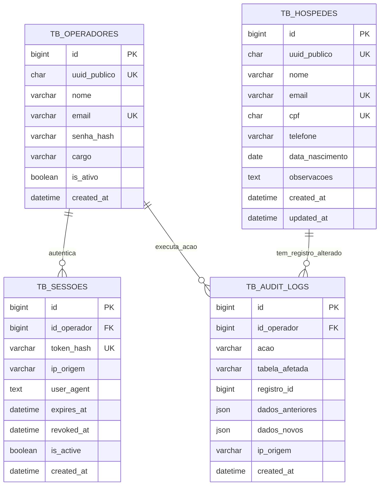

# Diretrizes e Arquitetura do Banco de Dados Relacional (Supabase PostgreSQL / SQLite)
### Sistema Grand Plaza Hotel Management — Especificação DDL e Integridade Relacional

Este documento estabelece as regras de modelagem de dados, convenções de nomenclatura, integridade referencial e auditoria para o banco de dados do sistema, em conformidade com as práticas de `@database-design` e `@backend-security-coder`.

---

## 1. Princípios Gerais e Nomenclatura

1. **Motor de Armazenamento e Compatibilidade**:
   - **Banco Primário em Produção (Nuvem)**: **Supabase (PostgreSQL 15+)**, garantindo transações ACID robustas, pooler PgBouncer integrado para conexões Serverless da Vercel e suporte nativo a tipos relacionais avançados.
   - **Banco de Resiliência Local (Avaliação)**: SQLite local (`hotel_grand_plaza.db`) empacotado no ZIP de entrega com a mesma semântica relacional ANSI, permitindo execução instantânea sem necessidade de provisionamento externo.
   - Charset padrão: `UTF-8` universal com suporte integral a acentuação da língua portuguesa.

2. **Convenção de Nomenclatura**:
   - Tabelas: Plural com prefixo semântico e snake_case: `tb_operadores`, `tb_sessoes`, `tb_hospedes`, `tb_audit_logs`.
   - Chave Primária Clusterizada (Física): `id BIGSERIAL PRIMARY KEY` (PostgreSQL) / `id INTEGER PRIMARY KEY AUTOINCREMENT` (SQLite).
   - Chave Pública (Exposição Externa / REST): `uuid_publico CHAR(36) NOT NULL UNIQUE DEFAULT (gen_random_uuid())`.
   - Chaves Estrangeiras: Prefixo `id_` seguido do nome da entidade no singular (`id_operador`, `id_hospede`).
   - Timestamps: Em UTC com precisão de milissegundos: `created_at TIMESTAMPTZ DEFAULT CURRENT_TIMESTAMP` e `updated_at TIMESTAMPTZ`.

---

## 2. Diagrama Entidade-Relacionamento (Mermaid ERD)

---

## 3. Especificação das Tabelas Principais

### 3.1. Tabela de Hóspedes (`tb_hospedes`) — Domínio do RF-001

Armazena as informações dos hóspedes garantindo unicidade legal e integridade:

| Coluna | Tipo | Nulo? | Descrição / Constraints |
| :--- | :--- | :---: | :--- |
| `id` | `BIGINT UNSIGNED` | Não | PK surrogate com auto_increment para B-Tree ultrarrápida. |
| `uuid_publico` | `CHAR(36)` | Não | Chave universal pública exposta no frontend/REST (`UNIQUE KEY`). |
| `nome` | `VARCHAR(150)` | Não | Nome completo do hóspede (mínimo 3 caracteres). |
| `email` | `VARCHAR(180)` | Não | E-mail corporativo ou pessoal único (`UNIQUE KEY`). |
| `cpf` | `CHAR(11)` | Não | Apenas 11 dígitos numéricos validados via Módulo 11 (`UNIQUE KEY`). |
| `telefone` | `VARCHAR(20)` | Não | Telefone com DDD no formato nacional ou internacional. |
| `data_nascimento` | `DATE` | Não | Data de nascimento para validação de maioridade. |
| `observacoes` | `TEXT` | Sim | Preferências do hóspede ou anotações operacionais. |
| `created_at` | `TIMESTAMP(3)` | Não | `DEFAULT CURRENT_TIMESTAMP(3)`. |
| `updated_at` | `TIMESTAMP(3)` | Não | `DEFAULT CURRENT_TIMESTAMP(3) ON UPDATE CURRENT_TIMESTAMP(3)`. |

---

### 3.2. Tabela de Operadores / Usuários do Sistema (`tb_operadores`)

Controla os funcionários que acessam o sistema administrativo:

| Coluna | Tipo | Nulo? | Descrição / Constraints |
| :--- | :--- | :---: | :--- |
| `id` | `BIGINT UNSIGNED` | Não | PK surrogate. |
| `uuid_publico` | `CHAR(36)` | Não | Identificador público (`UNIQUE KEY`). |
| `nome` | `VARCHAR(120)` | Não | Nome do funcionário. |
| `email` | `VARCHAR(150)` | Não | E-mail institucional de login (`UNIQUE KEY`). |
| `senha_hash` | `VARCHAR(255)` | Não | Hash Bcrypt da senha (mínimo 12 rounds de salt). |
| `cargo` | `VARCHAR(50)` | Não | Cargo operacional (`RECEPCIONISTA`, `GERENTE`, `ADMIN`). |
| `is_ativo` | `TINYINT(1)` | Não | `DEFAULT 1`. Define se o operador pode efetuar login. |
| `created_at` | `TIMESTAMP(3)` | Não | `DEFAULT CURRENT_TIMESTAMP(3)`. |

---

### 3.3. Tabela de Sessões com Expiração de Tokens (`tb_sessoes`)

Gerencia o ciclo de vida dos tokens de autenticação com revogação e auditoria:

| Coluna | Tipo | Nulo? | Descrição / Constraints |
| :--- | :--- | :---: | :--- |
| `id` | `BIGINT UNSIGNED` | Não | PK surrogate. |
| `id_operador` | `BIGINT UNSIGNED` | Não | `FOREIGN KEY` referenciando `tb_operadores(id)` ON DELETE CASCADE. |
| `token_hash` | `VARCHAR(64)` | Não | Hash SHA-256 do token (`UNIQUE KEY`). Nunca salvar o token em texto puro. |
| `ip_origem` | `VARCHAR(45)` | Sim | Endereço IP do operador (compatível com IPv4 e IPv6). |
| `user_agent` | `VARCHAR(500)` | Sim | Cabeçalho User-Agent para detecção de sessão anômala. |
| `expires_at` | `DATETIME(3)` | Não | Data e hora de expiração da sessão (ex: 8 horas). |
| `revoked_at` | `DATETIME(3)` | Sim | Timestamp de encerramento da sessão via logout explícito. |
| `is_active` | `TINYINT(1)` | Não | `DEFAULT 1`. Marcador para rápida verificação em query. |
| `created_at` | `TIMESTAMP(3)` | Não | `DEFAULT CURRENT_TIMESTAMP(3)`. |

**Índice de Lookup em Alta Performance**:
- `INDEX idx_sessoes_lookup (token_hash, is_active, expires_at)`: Permite validação da sessão em menos de 1ms sem table scan.

---

### 3.4. Tabela de Auditoria e Conformidade LGPD (`tb_audit_logs`)

Requisito mandatório para registro legal e rastreabilidade:

| Coluna | Tipo | Nulo? | Descrição |
| :--- | :--- | :---: | :--- |
| `id` | `BIGINT UNSIGNED` | Não | PK surrogate. |
| `id_operador` | `BIGINT UNSIGNED` | Sim | FK opcional do operador que realizou a operação. |
| `acao` | `VARCHAR(50)` | Não | Ação executada (ex.: `'CADASTRO_HOSPEDE'`, `'LOGIN'`, `'LOGOUT'`). |
| `tabela_afetada` | `VARCHAR(50)` | Não | Nome da tabela modificada. |
| `registro_id` | `BIGINT UNSIGNED` | Sim | ID da linha afetada. |
| `dados_anteriores` | `JSON` | Sim | Snapshot anterior em updates/deletes. |
| `dados_novos` | `JSON` | Sim | Snapshot dos dados criados ou atualizados. |
| `ip_origem` | `VARCHAR(45)` | Não | Endereço IP do cliente requisitante. |
| `created_at` | `TIMESTAMP(3)` | Não | `DEFAULT CURRENT_TIMESTAMP(3)`. |

---

## 4. Isolamento Transacional e Prevenção de Concorrência

1. **Nível de Isolamento**:
   - `READ COMMITTED` como padrão para eliminar leituras fantasmas sem gerar bloqueios de tabela indesejados.
2. **Tratamento de Concorrência no Cadastro de Hóspedes**:
   - Tentativas concorrentes de cadastro com o mesmo CPF ou E-mail geram violação imediata da constraint `UNIQUE KEY` (`Error 1062`). O backend intercepta o erro e responde com `HTTP 409 Conflict`.
3. **Resiliência Local**:
   - Para ambientes locais de teste e portabilidade no arquivo ZIP, a aplicação suporta espelhamento em SQLite mantendo a mesma semântica relacional.
