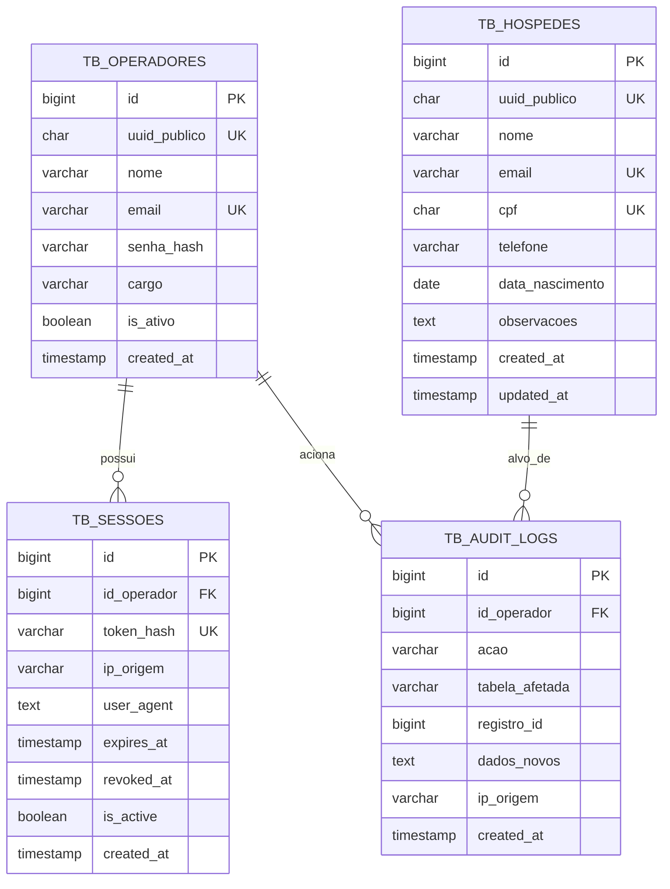

# Modelo de Dados Relacional (Data Model): Cadastro e Autenticação

**Feature ID**: `specs/001-cadastro-e-auth`  
**Bancos Alvo**: Supabase (PostgreSQL 15+) / SQLite 3 (Fallback Local)  
**Normas Vinculadas**: `regras/DB.md`

---

## 1. Diagrama Entidade-Relacionamento (Mermaid)

---

## 2. Índices de Alta Performance

1. **`tb_hospedes`**:
   - `UNIQUE INDEX uk_hospedes_email (email)`: Garante unicidade e busca em $O(1)$.
   - `UNIQUE INDEX uk_hospedes_cpf (cpf)`: Previne cadastros duplicados no nível do motor.
   - `UNIQUE INDEX uk_hospedes_uuid (uuid_publico)`: Permite buscas instantâneas por chave pública.

2. **`tb_sessoes`**:
   - `INDEX idx_sessoes_lookup (token_hash, is_active, expires_at)`: Permite validação do token do cookie em menos de 1ms sem table scan.
   - `INDEX idx_sessoes_operador (id_operador)`: Permite revogar instantaneamente todas as sessões de um operador em caso de logout ou bloqueio.
